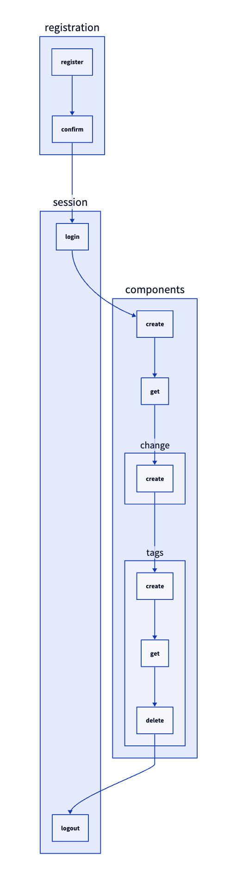

# tdag 🌀

A directed acyclic graph (DAG) driven testing framework for Go.

## Features

- Run tests in topological order.
- Intersect tests at a given position.
- Run tests up to a given test.
- Detect cycles and fail fast.
- Customizable context shared between tests 🔠.
- Generate visuals with [DOT](https://graphviz.org/doc/info/lang.html) and [D2](https://d2lang.com/) output.

## Installation

```sh
go get github.com/mateothegreat/go-tdag
```

## Examples

```go
dag := tdag.NewTDag(t)

// This will be run first, before any node is executed.
dag.Setup(func(ctx *tdag.TestContext) {
  ctx.Store.Set("setup", true)
  ctx.Store.Set("email", fmt.Sprintf("test-%d@example.com", time.Now().Unix()))
})

// This will be run last, after all nodes are executed.
dag.TearDown(func(ctx *tdag.TestContext) {
  ctx.T.Log("tear down")
})

dag.AddNode("user.register", func(ctx *tdag.TestContext) {
  ctx.T.Log("registered user")
})

dag.AddNode("user.login", func(ctx *tdag.TestContext) {
 email, err := ctx.Store.Get("email")
 assert.NoError(ctx.T, err)
 ctx.T.Logf("user.login: %s", email)
})

if _, err := dag.AddEdge("user.register", "user.login"); err != nil {
  t.Fatal(err)
}

dag.Run()
```

Running `go test -v` will output something similar to the kitchensink example:

```sh
go test -v
=== RUN   TestDag
=== RUN   TestDag/registration.register
=== NAME  TestDag
    tdag_test.go:27: before each
    tdag_test.go:38: registration.register
    tdag_test.go:31: after each
=== RUN   TestDag/registration.confirm
=== NAME  TestDag
    tdag_test.go:27: before each
    tdag_test.go:42: registration.confirm
    tdag_test.go:31: after each
=== RUN   TestDag/session.login
=== NAME  TestDag
    tdag_test.go:27: before each
    tdag_test.go:48: session.login: test-1730711721@example.com
    tdag_test.go:31: after each
=== RUN   TestDag/components.create
=== NAME  TestDag
    tdag_test.go:27: before each
    tdag_test.go:56: components.create
    tdag_test.go:31: after each
=== RUN   TestDag/components.get
=== NAME  TestDag
    tdag_test.go:27: before each
    tdag_test.go:60: components.create
    tdag_test.go:31: after each
=== RUN   TestDag/components.change.create
=== NAME  TestDag
    tdag_test.go:27: before each
    tdag_test.go:64: components.change.create
    tdag_test.go:31: after each
=== RUN   TestDag/components.tags.create
=== NAME  TestDag
    tdag_test.go:27: before each
    tdag_test.go:68: tags.create
    tdag_test.go:31: after each
    tdag_test.go:23: tear down
--- PASS: TestDag (0.00s)
    --- PASS: TestDag/registration.register (0.00s)
    --- PASS: TestDag/registration.confirm (0.00s)
    --- PASS: TestDag/session.login (0.00s)
    --- PASS: TestDag/components.create (0.00s)
    --- PASS: TestDag/components.get (0.00s)
    --- PASS: TestDag/components.change.create (0.00s)
    --- PASS: TestDag/components.tags.create (0.00s)
PASS
ok      github.com/mateothegreat/go-tdag/examples       0.198s
```


